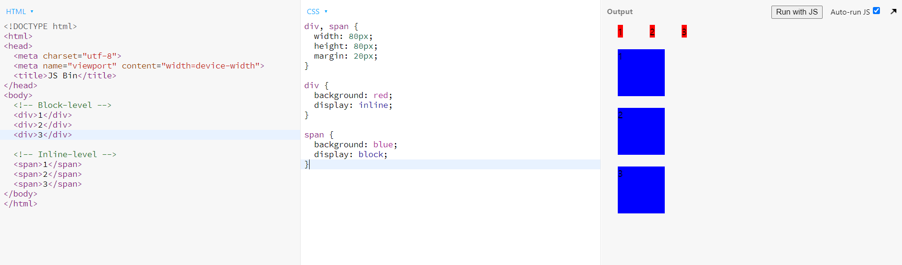
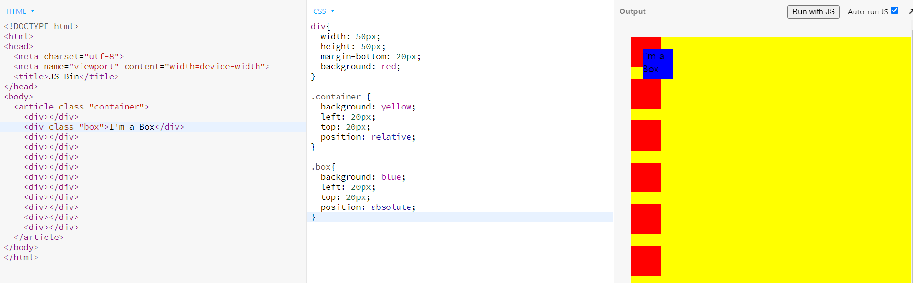
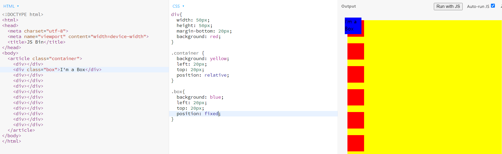

# CSS 레이아웃 정리 disply, position

> 필요한 내용만 정리합니다.

## reference

- [CSS 레이아웃 정리 display, position 완성 | 프론트엔드 개발자 입문편: HTML, CSS, Javascript](https://www.youtube.com/watch?v=jWh3IbgMUPI&list=PLv2d7VI9OotQ1F92Jp9Ce7ovHEsuRQB3Y&index=8)

## Block-level과 Inline-level

- 내용이 없을 때
  
- 내용이 있을 때
  

## Display 미리보기

- div의 display값을 inline으로, 값이 없을 때
  
- div의 display값을 inline으로, 값이 있을 때
  
- div의 display값을 inline-block으로, 값이 없을 때
  

## Display 이해하기

- `inline` : content 자체만을 꾸며준다.
  - width나 height를 지정해줘도 무시한다.
- `inline-block` : 말 그대로, 한 줄에 여러 개 놓는데, 상자로 변환되어서 컨텐츠의 사이즈에는 상관 없이 지정한 박스의 width와 height에 맞춰진다.
- `block` : 상자인데 한 줄 당 하나

## Position 미리보기

- 지정 이전
  
- left와 top의 값을 지정(변화 없음)
  
- 그 이유는 position의 defalut값이 static이기 때문
  
- position을 relative로 변경(left,top 값 적용)
  

## Position 이해하기

- `static` : 기본값
- `relative` : 원래있어야 하는 자리에서 설정한 값만큼 이동
  
- `absolute` : 내 아이템이 담겨있는, 가장 가까운 박스 안에서 위치변경이 일어남(예시에서는 article 왼쪽 위 기준으로 left와 top 값이 적용됨)
  
- `fixed` : 상자안에서 완전히 벗어나 window 안에서 움직인다.(웹페이지 기준)
  
- `sticky` : 원래 있어야하는 자리에 있는데, 스크롤링 되었을 때도 있던 곳에 붙어있는다.
  

## 브라우저 호환성을 검사하자

- [MDN CSS](https://developer.mozilla.org/ko/docs/Web/CSS)
- [Can I use](https://caniuse.com/)
- 이번 포스트의 내용은 대부분의 브라우저가 호환하지만 explorer는.. 안된다.
  - 최신 버전으로 작성한 CSS가 적용되지 않을 때는, CSS 프레임워크(PostCSS) 들이 해결해 줄 수 있다.
