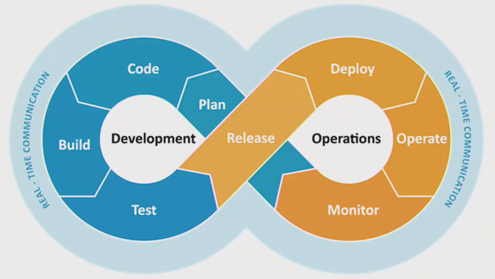
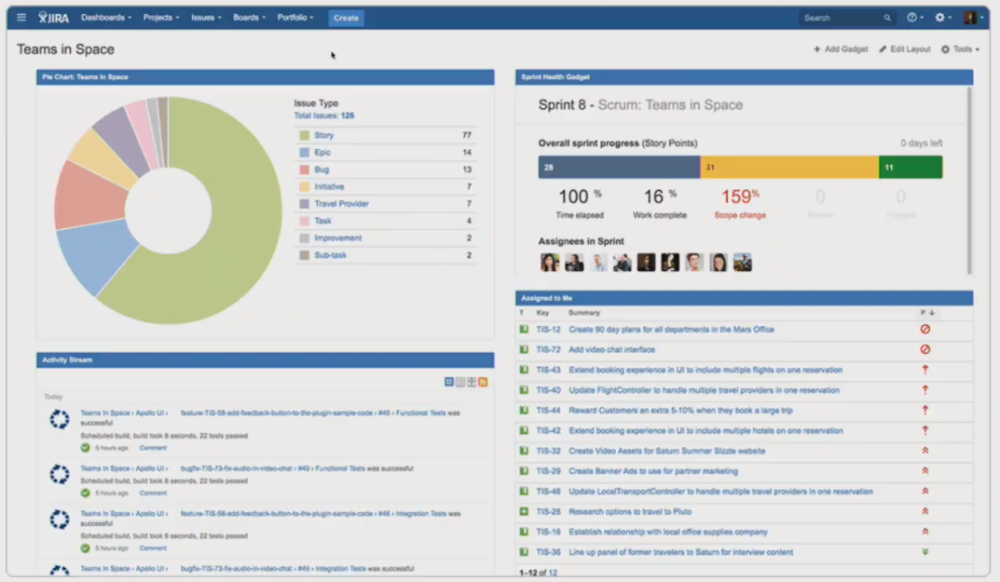
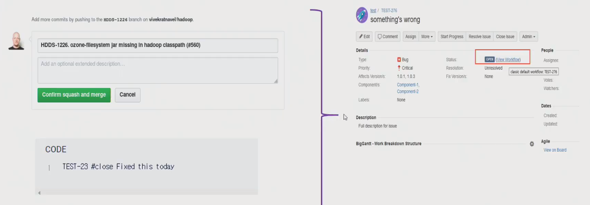

# Jira 및 JQL 활용법

> 새롭게 알게 된 내용을 정리합니다.

## DevOps를 잘 수행하기 위한 조건

- 반복적인 작업들을 Tool을 이용해서 자동화
- 팀원 모두가 알고 있는 하나의 공유된 지표가 필요
- 장애나 이슈가 있을 때 혼자만 알지 말고 팀원들과 공유 필요
- 등등

## DevOps 중 Jira가 담당하는 역할

- 팀원 모두가 알고 있는 하나의 공유된 지표가 필요
- 장애나 이슈가 있을 때 혼자만 알지 말고 팀원들과 공유 필요

## Jira 사용해보기

### Issue Type

- Story : 스토리(`ex.회원가입`)
- Task : 할 일(작은 개발 단위, `ex.회원가입 창 디자인`)
- Bug : 버그 발생 시
- Epic : 하나의 큰 틀, 테마(`ex.유저관리`)

### Issue 창 살펴보기

- Details : 세부내용
- Description : 설명
- Assignee : 담당자
- Reporter : 생성자
- Status : WorkFlow 중 현재 상태
- Component/s : 하나의 개발 항목 혹은 팀, 이슈들을 묶을 때 기준(Epic으로 묶기 애매할 때, `ex.Frontend`).
- Resolution : 이슈 완료 여부(완료 : `Done`)

## JQL(Jira Query Language)

- Jira Issue를 구조적으로 검색하기 위해 제공하는 언어
- SQL과 비슷한 문법
- Jira의 각 필드들에 맞는 특수한 예약어들을 제공
- 쌓인 Issue들을 재가공해 유의미한 데이터를 도출해 내는데 활용(Gadget, Agile Board 등)

### JQL 사용하기

- Issue>Search for issue 탭
- basic query : 버튼을 클릭해서 항목을 선택
- Advanced 탭 : JQL 사용가능
- `project = DP AND assignee in (currentUser())`

### JQL Operators

- `=`, `!=`, `>`, `>=`
- `in`, `not in`
- `~`(contains), `!~`(not contains)
- `is empty`, `is not empty`, `is null`, `is not null`

### Date in Jira

- `project = DP AND assignee in (currentUser()) and updated > -1d(1w)` : DP프로젝트에서 내가 담당자이면서 어제(지난 주) 이후로 수정된 이슈들에 대해 보여달라.

### JQL Keywords

- AND
- OR
- NOT
- EMPTY
- NULL
- ORDER BY

### JQL Functions

- `project = DP AND assignee in (currentUser()) and updated > startOfWeek(2d)` : DP프로젝트에서 내가 담당자이면서 일요일보다 이틀 뒤인 화요일 이후로 수정된 이슈들에 대해 보여달라.

### JQL 활용예시 : Filter share

- `project = DP AND updated > startOfWeek(1d) and updated < endOfWeek(-1d)` : DP프로젝트에서 일요일보다 이틀 뒤인 화요일 이후 그리고 토요일보다 하루 전인 금요일 이전에 수정된 이슈들에 대해 보여달라.
  - 위 JQL을 저장해서 다른 사람들도 같은 검색을 할 수 있다.
  - Filter 사용 권한도 수정 가능
  - Find Filter에서 남의 Filter도 볼 수 있음
  - 즐겨찾기 필터 지정 가능

## Dashboard & Gadget

### Dashboard

- System Dashboard : 처음 들어왔을 때 보이도록 설정한 화면
- Dashboard 생성
  - Dashboard > Mange Dashboard > Create Dashboard 탭
  - 공유도 가능하다.
  - 별표를 누르면 System Dashboard가 내가 만든 대쉬보드로 된다.

### Gadget

원하는 가젯을 대쉬보드에 설정하면 보여진다.

- Assigned to Me : 나에게 할당된 이슈를 보여주는 가젯(필터 적용x)
- Filter Results : 필터의 결과를 보여주는 가젯
- Pie Chart : 필터를 이용해서 Pie Chart를 그려준다.
  

### Agile Board

- Scrum Board :
  - sprint라는 주기 개념이 있다.
  - 백로그라는 곳에 이슈들을 모아놓고 sprint에 이슈들을 옮겨넣어 이슈를 끝낸다.
  - scrum 방법론과 함께 사용하는 보드
- Kanban Board
  - 일을 작은 조각으로 나누고, 카드에 각 항목을 기입한다.
  - 이름이 부여된 열을 사용하여 각 항목이 작업 흐름의 어디에 있는지 표시한다.

## 현업에서의 Jira 활용

1. issue tracking
   

2. git commit 시에 이슈 다루기
   
