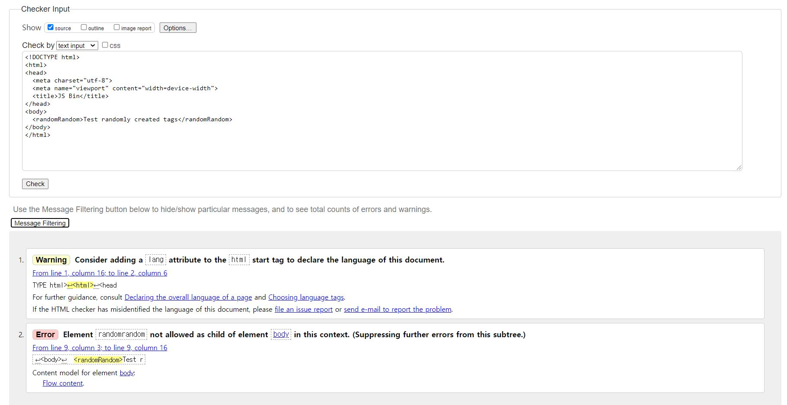

# HTML Tip

> 필요한 부분만 정리합니다.

## Markup Language란?
일반적인 텍스트와 문법적으로 구별하기 위해서 문서에 annotating(주석을 다는) 된 것어느 정도 태그들을 이용해 구조적으로 작성된 것

## 지원가능한 정리된 태그들은 어디서 확인하나요?
- 추천사이트 : 
    - [MDN HTML](https://developer.mozilla.org/ko/docs/Web/HTML)
    - [MDN HTML Element References](https://developer.mozilla.org/ko/docs/Web/HTML/Element)

## 임의로 이상한 태그를 사용하면 어떻게 되나요?
- 브라우저가 대략적으로 짐작해서 컨텐츠를 보여주긴 한다.

- 유효한 태그를 사용했는지는 어떻게 알 수 있나요?
    - [vaildator](https://validator.w3.org/)

## 브라우저마다 지원되지 않는 태그나 속성들도 있다.
- [MDN HTML](https://developer.mozilla.org/ko/docs/Web/HTML)에서 확인 가능

## Documnet and website structure
- [Documnet and website structure](https://developer.mozilla.org/en-US/docs/Learn/HTML/Introduction_to_HTML/Document_and_website_structure)
- 웹 사이트들은 박스들로 구성되어있다.

    - [이미지 출처 및 추가정보 : Oracle](https://docs.oracle.com/cd/E29542_01////webcenter.1111/e63259/jpsdg_pagetemp.htm#JPSDG13585)
    - 박스들은 또 다시 작은 박스들로 구성되고, 이렇게 작은 단위들로 나누어야 프레임워크에서 퍼포먼스 성능이 좋아진다. 

