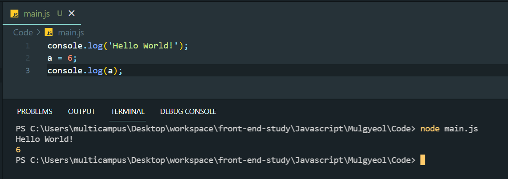

# Javascript_01 - ansyc와 defer의 차이점

> 이 문서는 [드림코딩 by 엘리의 자바스크립트 기초 강의 (ES5+)](https://www.youtube.com/watch?v=wcsVjmHrUQg&list=PLv2d7VI9OotTVOL4QmPfvJWPJvkmv6h-2)를 바탕으로 작성되었습니다.

## Javascript 학습 사이트

- [ecma-international.org, 공식사이트](https://www.ecma-international.org/) : 개발자가 보기에 좀 난해할 수 있다.
- [MDN - JavaScript](https://developer.mozilla.org/ko/docs/Web/JavaScript) : 추천하는 사이트

## ansyc와 defer의 차이점

```html
<!DOCTYPE html>
<html lang="en">
  <head>
    <meta charset="UTF-8" />
    <meta http-equiv="X-UA-Compatible" content="IE=edge" />
    <meta name="viewport" content="width=device-width, initial-scale=1.0" />
    <title>Document</title>
    <script src="main.js"></script>
  </head>
  <body></body>
</html>
```

위 와 같은 형태로 html파일이 작성되었을 때, 페이지가 보여지기까지 무슨 일이 일어날까?

### Web Browser에서 페이지가 보여지기까지 동작 과정(간략히)

1. 브라우저는 HTML을 위에서 한 줄씩 pasring한다.
2. script태그를 만나면 parsing을 잠시 멈추고, 필요한 js파일을 서버에서 다운받아 실행한다.
3. 그 다음, 다시 parsing을 이어한다.

### 문제점

- head 태그 안에 script 태그 작성 시
  - 만약, js파일이 매우 크고, 인터넷 속도가 느리다면 사용자가 웹사이트를 보기까지 많은 시간이 소요된다.
- body 태그 안에 script 태그 작성 시
  - 사용자가 기본적인 html의 컨텐츠를 빨리 보지만, 웹사이트가 js에 의존적이라면 사용자가 의미있는 컨텐츠를 보기 위해서는 fetching(서버에서 받아오기)과 excuting(실행)이 이루어지는 동안 기다려야한다.

### head + async

```html
<!DOCTYPE html>
<html lang="en">
  <head>
    <meta charset="UTF-8" />
    <meta http-equiv="X-UA-Compatible" content="IE=edge" />
    <meta name="viewport" content="width=device-width, initial-scale=1.0" />
    <title>Document</title>
    <script async src="main.js"></script>
  </head>
  <body></body>
</html>
```

- async : boolean 타입의 속성 값이므로 선언만으로 true라 사용가능하다.

  - script태그를 만나면 `병렬`로 main.js를 받는다.
  - parsing과 fetching js가 동시에 이루어진다.
  - fetching이 끝나면 parsing을 멈추고 js파일을 실행한다.
  - 실행이 끝나면 나머지 html을 파싱한다.

- 장점
  - 다운로드 받는 시간을 절약할 수 있다.
- 단점
  - 완전히 html이 parsing되기 전에 실행되므로 DOM요소 조작에 문제(정의 전 실행)가 있을 수 있다.
  - 중간에 parsing을 멈추고 js파일이 실행되는 시간이 있어서 사용자가 페이지를 보는데 시간이 아직 걸린다.

### head + defer

```html
<!DOCTYPE html>
<html lang="en">
  <head>
    <meta charset="UTF-8" />
    <meta http-equiv="X-UA-Compatible" content="IE=edge" />
    <meta name="viewport" content="width=device-width, initial-scale=1.0" />
    <title>Document</title>
    <script defer src="main.js"></script>
  </head>
  <body></body>
</html>
```

- defer
  - script태그를 만나면 `병렬`로 main.js를 받는다.
  - parsing과 fetching js가 동시에 이루어진다.
  - fetching이 끝나도 parsing을 계속한다.
  - parsing이 끝나면 js파일을 실행한다.

### async와 defer 비교하기

#### async

```html
<!DOCTYPE html>
<html lang="en">
  <head>
    <meta charset="UTF-8" />
    <meta http-equiv="X-UA-Compatible" content="IE=edge" />
    <meta name="viewport" content="width=device-width, initial-scale=1.0" />
    <title>Document</title>
    <script async src="a.js"></script>
    <script async src="b.js"></script>
    <script async src="c.js"></script>
  </head>
  <body></body>
</html>
```

- 위 처럼 작성하면 각 js파일의 fetching 이 끝날때마다 parsing이 중단되고, 자바스크립트 파일이 실행된다.
- 따라서, parsing이 멈춘상태의 시간이 길어진다.
- 또, b.js 파일이 먼저 받아졌는데, b.js를 사용하는데 a.js가 선행된다면 문제가 생길 수 있다.

#### defer

```html
<!DOCTYPE html>
<html lang="en">
  <head>
    <meta charset="UTF-8" />
    <meta http-equiv="X-UA-Compatible" content="IE=edge" />
    <meta name="viewport" content="width=device-width, initial-scale=1.0" />
    <title>Document</title>
    <script defer src="a.js"></script>
    <script defer src="b.js"></script>
    <script defer src="c.js"></script>
  </head>
  <body></body>
</html>
```

- 위 처럼 작성하면 html parsing이 계속 이루어지면서 각 js파일의 fetching된다.
- html parsing이 모두 끝나면 자바스크립트 파일들이 실행된다.
- b.js를 사용하는데 a.js가 선행된다고 해도, 파일들이 모두 준비된 상태이기 때문에 실행 가능하다.

## Use strict!

- Javascript를 이용할 때, 맨 위에 `'use strict';`를 작성해주는 것이 좋다.
- Javascript는 빠르게 만들어졌고, 매우 유연하다. 이것은 때로는 매우 위험하다.
  - 선언되지 않은 변수에 값을 할당
  - 기존에 존재하는 프로토타입을 변경
- ECMAScript5에 선언된 `use strict`을 선언하게 되면, 비상식적인 상황이 발생하지 않는다.
- Javascript 엔진이 더 빠르고 효율적으로 Javscript를 분석할 수 있다 => `성능 개선`



