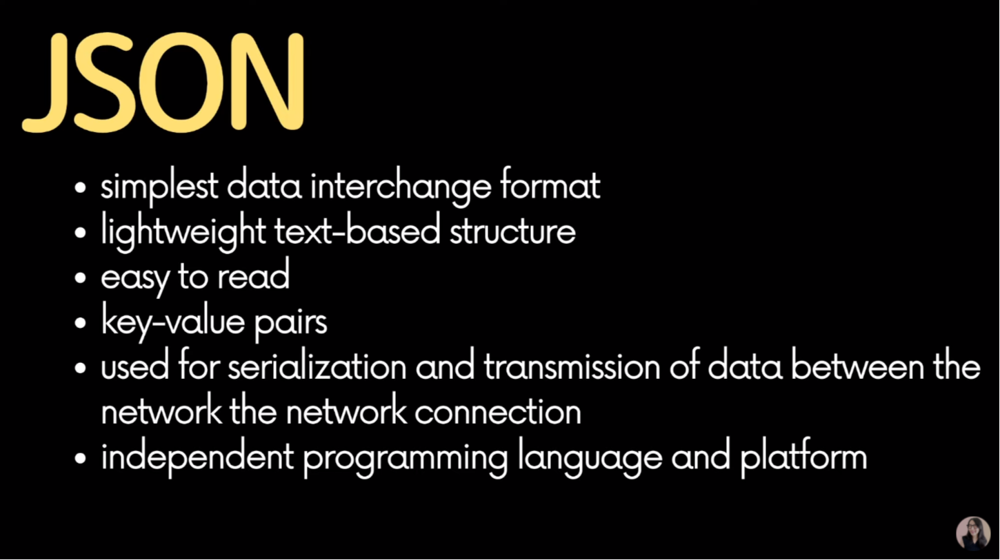

# Javascript_09 - JSON 개념 정리 와 활용방법 및 유용한 사이트 공유

> 이 문서는 [드림코딩 by 엘리의 자바스크립트 기초 강의 (ES5+)](https://www.youtube.com/watch?v=wcsVjmHrUQg&list=PLv2d7VI9OotTVOL4QmPfvJWPJvkmv6h-2)를 바탕으로 작성되었습니다.

## 용어정리

### HTTP

- Hypertext Transfer Protocol
- Hypertext : 링크, 문서, 이미지를 포함한다.

### AJAX

- Asynchronous Javascript And XML

  - 대표적인 예
    - XHR(XMLHttpRequest) Object
      - 브라우저 API에서 제공하는 Object 중 하나
    - fetch() API
      - 지원하는 브라우저를 확인해야한다.

- XML을 사용하면 불필요한 태그가 많아 사이즈가 커지고, 가독성도 좋지 않아서
- JSON을 많이 사용한다.

### JSON

- Javascript Object Notation
- ECMAScript 3rd 1999 Object에서 영감을 받아 만들어지 데이터 포멧
- Object{key: value}
- 브라우저 뿐만아니라 모바일에서 서버와 통신할 때, Object를 File System에 저장할 때 이용된다.
  

## JSON 공부 포인트

1. Object를 어떻게 serialize(직렬화)해서 JSON으로 변환할 것인가?
2. 직렬화된 JSON을 어떻게 deserialize해서 Object로 변환할 것인가?

### JSON 실습

#### stringify

```js
// 1. Object to JSON
// stringify(object)
let json = JSON.stringify(true);
console.log(json); // true

json = JSON.stringify(["apple", "banana"]);
console.log(json); //["apple", "banana"]

const rabbit = {
  name: "tori",
  color: "white",
  size: null,
  birthDate: new Date(),
  jump: () => {
    console.log(`${this.name} can jump!`);
  },
};

json = JSON.stringify(rabbit);
console.log(json); // {"name":"tori","coplor":"white","size":null,"birthDate":"2021-07-10T14:05:48.102Z"}

// 함수는 json에 포함되지 않는다.
// Javascript에만 있는 특별한 데이터도 json에 포함되지 않는다.

json = JSON.stringify(rabbit, ["name"]); //name 프로퍼티만 골라서 JSON으로 바꾼다.
console.log(json);

json = JSON.stringify(rabbit, ["name", "color", "size"]);
console.log(json);

//세밀한 통제를 위한 callback 함수 이용
json = JSON.stringify(rabbit, (key, value) => {
  console.log(`key: ${key}, value: ${value}`);
  return key === "name" ? "mulgyoel" : value;
});
console.log(json);
```

#### parse

```js
/ 2. JSON to Object
// parse(json)

json = JSON.stringify(rabbit);
const obj = JSON.parse(json);
console.log(obj);
rabbit.jump();
// obj.jump(); //error

console.log(rabbit.birthDate.getDate()); // birthDate는 Date object이다.
//console.log(obj.birthDate.getDate()); //error, birthDate가 String 형식이기 때문

//세밀한 통제를 위한 callback 함수 이용
const obj2 = JSON.parse(json, (key, value) => {
    console.log(`key: ${key}, value: ${value}`);
    return key === 'birthDate' ? new Date(value) : value;
});

console.log(obj2.birthDate.getDate()); //error, birthDate가 String 형식이기 때문
```

## 유용한 사이트

- [JSON Diff](http://jsondiff.com/)
  - JSON 데이터끼리 뭐가 다른지 보여준다.
  - debugging시 유용하다.
- [JSON beautifier](https://jsonbeautifier.org/)
  - 깔끔하게 포맷을 바꿔준다.
- [JSON Parser](https://jsonparser.org/)
  - json으로부터 object가 어떻게 표기되어지는지 눈으로 확인할 수 있다.
- [JSON Validator](https://tools.learningcontainer.com/json-validator/)
  - 유효한 json인지 확인할 수 있다.
  - 에러를 잡기 편하다.
